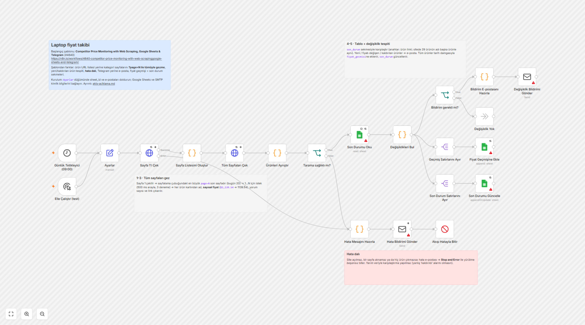

# Bölüm B — Laptop fiyat takibi (n8n akışı)

## Başlangıç şablonu

**[Competitor Price Monitoring with Web Scraping, Google Sheets & Telegram](https://n8n.io/workflows/4640-competitor-price-monitoring-with-web-scrapinggoogle-sheets-and-telegram/)** (n8n şablon #4640)

**Neden bu şablon?** n8n kütüphanesinde "price monitoring" araması yaptım. Bu şablon, ücretli bir kazıma servisi (Bright Data, Decodo, ScrapeGraphAI vb.) kullanmadan yalnızca **HTTP Request + HTML + Code + Google Sheets** ile çalışan ve en çok görüntülenen sonuçtu. Senaryomuzdaki test sitesi statik HTML olduğu için ücretli bir scraper'a gerek yok.

Şablonun JSON'unu n8n'in şablon API'sinden (`api.n8n.io/api/templates/workflows/4640`) indirip düğüm düğüm inceledim. Sonra senaryoya uyarladım.

## Akış adım adım

**n8n editöründe (ekran görüntüsü):** `workflow.json`, yerel n8n 2.40.7 editörüne yüklenmiş hâli. Kırmızı üçgenler, credential'ı bağlanmamış Google Sheets ve SMTP düğümlerini gösteriyor; bu beklenen durum.

*Görüntü nasıl alındı:* Yerel n8n'in normal arayüzü sahip hesabı kurulumu istiyor. Bu yüzden n8n, önizleme modunda (`N8N_PREVIEW_MODE=true`) başlatıldı. `workflow.json` editörün `/workflows/demo` görünümüne, n8n'in kendi gömme bileşeninin kullandığı `openWorkflow` mesajıyla yüklendi. Ekran görüntüsü headless Edge ile alındı. Bu bir **tasarım görünümü**, çalıştırma görünümü değil. Gerçek çalıştırma sonuçları [n8n-calistirma-kaydi.md](n8n-calistirma-kaydi.md) içinde.

**Şema (`workflow.json`'dan üretildi):**

| # | Düğüm | Ne yapıyor |
|---|-------|-----------|
| 1 | **Günlük Tetikleyici (09:00)** | Schedule Trigger, günde 1 kez saat 09:00'da çalışır (workflow saat dilimi: `Europe/Istanbul`). Test için yanında bir **Elle Çalıştır (test)** Manual Trigger'ı da var. |
| 2 | **Ayarlar** | Tüm yapılandırma tek yerde: kaynak URL, `max_sayfa` güvenlik sınırı (50), Google Sheet ID, bildirim e-postaları. |
| 3 | **Sayfa 1'i Çek** | HTTP GET (metin olarak), 3 deneme. **Site açılmazsa** hata çıkışı hata dalına gider. |
| 4 | **Sayfa Listesini Oluştur** | Sayfalama çubuğundaki en büyük `?page=N` son sayfadır (bugün 20). 1..N için birer öğe üretir. Sayfa sayısı elle yazılmadı; site büyürse akış kendi uyum sağlar. |
| 5 | **Tüm Sayfaları Çek** | Her sayfa için ayrı istek: 500 ms arayla (siteye nazik), 3 deneme. Açılamayan sayfa akışı durdurmaz, hata öğesi olarak bir sonraki adıma gelir ve orada sayılır. |
| 6 | **Ürünleri Ayrıştır** | Her ürün kartından **ad, fiyat (sayı), yorum sayısı, link** çıkarır. `$1,139.54` → `1139.54` (para simgesi ve binlik virgül temizlenir). Link'e göre tekilleştirir. **Her zaman tek bir özet öğe** döndürür; `saglikli` alanı ürün yoksa ya da sayfa eksikse `false` olur. |
| 7 | **Tarama sağlıklı mı?** | IF: sağlıklıysa devam eder, değilse **hata dalına** gider. |
| 8 | **Son Durumu Oku** | Google Sheets `son_durum` sekmesi (önceki çalışma). *Always Output Data* açık, çünkü ilk çalışmada sekme boştur ve boş sonuçta akış sessizce biterdi. |
| 9 | **Değişiklikleri Bul** | Anahtar ürün linki. Üç liste çıkarır: **yeni çıkan**, **fiyatı değişen** (eski/yeni/fark/%) ve **listeden kalkan** ürünler. İlk çalışmada 117 ürünü "yeni" diye bildirmez, sadece "referans kaydedildi" e-postası gider. |
| 10 | **Bildirim gerekli mi? → Bildirim E-postasını Hazırla → Değişiklik Bildirimi Gönder** | Değişiklik varsa HTML tablolu e-posta gönderir (en büyük değişim en üstte). Değişiklik yoksa e-posta gitmez. |
| 11 | **Geçmiş Satırlarını Ayır → Fiyat Geçmişine Ekle** | Tüm ürünler **tarih damgasıyla** (`tarih`, `calisma_zamani`) `fiyat_gecmisi` sekmesine eklenir (append). |
| 12 | **Son Durum Satırlarını Ayır → Son Durumu Güncelle** | `son_durum` sekmesi `link` sütununa göre güncellenir (appendOrUpdate). Kalkan ürünler `durum=kaldirildi` olarak işaretlenir ve bir kez raporlanır. |
| H1 | **Hata Mesajını Hazırla** | İki kaynaktan beslenir: site hiç açılmadıysa (adım 3'ün hata çıkışı) ya da tarama sağlıksızsa (adım 7). Anlaşılır bir neden metni üretir. |
| H2 | **Hata Bildirimi Gönder** | Hata e-postası. Bu adım da başarısız olsa akış yine devam edip hatayla biter. |
| H3 | **Akışı Hatayla Bitir** | **Stop and Error**: yürütme n8n'de *başarısız* görünür. Akış sessizce "başarılı" bitmez. |

**Dalların sırası bilinçli:** n8n (executionOrder v1) paralel dalları yukarıdan aşağıya çalıştırır. Önce bildirim, sonra tablolar güncellenir. E-posta gönderilemezse akış hata verir ve tablolar güncellenmez; böylece ertesi gün aynı değişiklik tekrar yakalanır ve kaybolmaz. Ters sırada olsaydı değişiklik tabloya yazılır ama hiç bildirilmezdi.

**Ek güvenlik ağı:** `hata-workflow.json` (Error Trigger → e-posta). Beklenmeyen her hatada (örn. Google kimlik bilgisinin süresi dolması) bildirim gönderir. Ana akışın ayarlarında `errorWorkflow: hataBildirimAkis` olarak zaten bağlı. İçe aktardıktan sonra hata akışını **aktif** etmek yeterli (n8n 2.40'ta aktif değilse çağrılamıyor, bkz. [çalıştırma kaydı](n8n-calistirma-kaydi.md)).

## Kapsanması istenenler

| İstenen | Karşılığı |
|---------|-----------|
| Günde 1 kez zamanlanmış tetikleyici | `Günlük Tetikleyici (09:00)`: Schedule Trigger, `triggerAtHour: 9` |
| Tüm sayfaları gezen adım | `Sayfa 1'i Çek` → `Sayfa Listesini Oluştur` (son sayfa = en büyük `page=N`) → `Tüm Sayfaları Çek` (1..N) |
| Ad, fiyat (sayı), yorum, link | `Ürünleri Ayrıştır`: `fiyat` bir **Number**, `$` ve `,` temizlenir |
| Tarih damgasıyla tabloya yazma | **Google Sheets** · `fiyat_gecmisi` sekmesi (append, `tarih` + `calisma_zamani`) |
| Değişiklik tespiti + bildirim | `Değişiklikleri Bul` (yeni / fiyatı değişen / kalkan) → **e-posta** (Send Email / SMTP) |
| Hata dalı | Site açılmazsa / sayfa eksikse / ürün yoksa: hata e-postası → **Stop and Error** |

## Şablondan neyi değiştirdim

| Şablonda | Bu akışta | Neden |
|----------|-----------|-------|
| Sheet'te önceden listelenmiş ürün URL'leri tek tek ziyaret ediliyor | Kategori sayfaları **`?page=N` ile baştan sona geziliyor**, ürünler listeden çıkarılıyor | Case "ilk sayfayla yetinme, tüm laptopları çek" istiyor. Yeni ürün ancak liste gezilirse bulunur. |
| Sadece fiyat değişimi | **Yeni çıkan** ve **listeden kalkan** ürünler de tespit ediliyor | Case "fiyatı değişen veya yeni çıkan" istiyor. |
| Hata dalı yok. Fiyat okunamazsa `NaN !== eski_fiyat` true döner ve **yanlış alarm** üretir | Tarama sağlık kontrolü + hata dalı + Stop and Error. Geçersiz fiyatlı kart sayılır ve raporlanır | "Akış sessizce başarılı bitmez" şartı. |
| Ürün başına 20 sn bekleme + her güncelleme öncesi 1 dk bekleme (117 ürün ≈ 2 saatten fazla) | Sayfa başına 500 ms (20 sayfa ≈ 10 sn) | Liste sayfası başına 6 ürün geldiği için ürün sayfalarını tek tek açmaya gerek yok. |
| Telegram | E-posta (Send Email/SMTP) | Tercih e-posta oldu. Firma Microsoft 365 kullanıyorsa SMTP ile doğrudan çalışır. |
| `master` + `Price_History` sekmeleri, satır numarasıyla güncelleme | `son_durum` (anahtar: link, appendOrUpdate) + `fiyat_gecmisi` (append) | Satır numarası, ürün eklenip çıktıkça kayar. Link kalıcı bir anahtardır. |
| Tarih biçimi Hindistan saatine (IST) sabitlenmiş | Workflow saat dilimi `Europe/Istanbul`, tarih ISO (`YYYY-MM-DD`) | Yerel kullanım. ISO tarih tabloda sıralanabilir. |
| Code düğümlerinde "temizlik" için ekstra adım (tab'lı sütun adları) | Sütun adları baştan temiz | Şablondaki sheet'te `timestamp\t` gibi sütun adları vardı. |

## Google Sheets hazırlığı

Bir Google Sheet oluşturun, ID'sini `Ayarlar → sheet_id` alanına yazın. İki sekme açın ve ilk satıra başlıkları girin:

- **`fiyat_gecmisi`**: `tarih | calisma_zamani | urun_id | ad | fiyat | yorum_sayisi | link`
- **`son_durum`**: `link | urun_id | ad | fiyat | yorum_sayisi | ilk_gorulme | son_gorulme | durum`

Kimlik bilgileri: Google Sheets düğümlerine **Google Sheets OAuth2**, e-posta düğümlerine **SMTP** bağlanır. Credential'lar JSON'da **yoktur** (depoda anahtar/parola bulunmuyor).

## İçe aktarma

1. n8n → *Workflows → Import from File* → önce `hata-workflow.json`, sonra `workflow.json`. CLI ile: `n8n import:workflow --input=workflow.json`.
   - **Arayüzden içe aktarırken dikkat:** n8n içe aktarılan akışa yeni bir id veriyor. Bu yüzden ana akıştaki `errorWorkflow: hataBildirimAkis` bağlantısı boşa düşer. Ana akışta *Settings → Error Workflow* alanından "Hata Bildirimi (Error Workflow)" akışını bir kez seçin. CLI ile içe aktarımda id'ler korunuyor, bu adım gerekmiyor.
2. `Ayarlar` düğümünde `sheet_id`, `bildirim_eposta`, `gonderen_eposta` alanlarını doldurun (hata akışındaki e-posta adreslerini de).
3. Sheets ve SMTP credential'larını seçin → **Elle Çalıştır (test)** ile deneyin → iki akışı da **Active** yapın.

## Nasıl test ettim

- **Code düğümlerinin JS'i ayrı dosyalarda** (`kod/*.js`). `araclar/workflow_olustur.py` bu dosyaları `workflow.json`'a gömer ve yapıyı doğrular (benzersiz ad/id, var olmayan düğüme bağlantı ya da `$('...')` referansı yok, kopuk düğüm yok). Böylece n8n'e giden kod, test edilen kodla birebir aynıdır.
- `node test/kod-testi.mjs`: n8n'in `$input` / `$('Düğüm')` ortamını taklit ederek aynı JS'i çalıştırır:
  - **Canlı site:** 20 sayfa bulundu ve gezildi, **117 ürün** (sitedeki "117 items" ile aynı), tüm fiyatlar sayı ($295.99–$1799).
  - **29 ürünün adı başka bir ürünle aynı.** Bu yüzden karşılaştırma anahtarı ad değil, link.
  - `$1,139.54` → 1139.54. Ürünsüz sayfa / açılamayan sayfa → tarama sağlıksız. Site kapalı → anlaşılır hata mesajı.
  - Değişiklik tespiti: 1 fiyatı değişen (önceki fiyat Türkçe biçimli `"426,99"` string olarak gelse de), 1 yeni, 1 kalkan ürün doğru ayrılıyor. Değişiklik yoksa e-posta yok. İlk çalışmada alarm yağmuru yok. Kalkan ürün bir kez raporlanıyor.

- **Gerçek n8n'de (2.40.7, yerel kurulum) CLI ile içe aktarıldı ve çalıştırıldı.** Normal çalışmada 20 sayfa, 117 ürün, `saglikli: true` sonucu alındı ve akış credential bağlanmamış Google Sheets adımına kadar hatasız geldi. İki hata senaryosunda da (site kapalı / hiç ürün yok) hata dalı çalıştı ve yürütme `error` durumunda bitti. Düğüm düğüm sonuçlar: **[n8n-calistirma-kaydi.md](n8n-calistirma-kaydi.md)**. Bu test iki eksik ortaya çıkardı ve ikisi de düzeltildi: CLI içe aktarımı için workflow `id`, CLI ile çalıştırma için Manual Trigger.

## Bilinen sınırlar / dürüst notlar

- **Google Sheets ve e-posta adımları credential olmadan çalıştırılamadı.** Bu adımlar (okuma, append, appendOrUpdate, e-posta) canlı test edilmedi. Parametreleri şablonun gerçek JSON'u ve n8n-nodes-base paketindeki düğüm tanımları esas alınarak yazıldı. İçe aktarımdan sonra Sheets düğümlerindeki sütun eşlemesinin (`autoMapInputData`) sekme başlıklarıyla eşleştiği bir kez kontrol edilmeli. Bu adımların girdisi olan `Değişiklikleri Bul` mantığı ise Node testleriyle doğrulandı.
- Ekran görüntüsü editörün **tasarım görünümü**. Çalıştırma görünümünün ekran görüntüsü yok, çünkü yerel n8n arayüzü sahip hesabı kurulumu istiyor. Çalıştırmanın kanıtı CLI çalıştırma kaydı.
- HTML ayrıştırma Code düğümünde düzenli ifadelerle yapılıyor (n8n Code düğümünde cheerio yok). Site şablonu değişirse `saglikli=false` → hata e-postası gider; sessizce yanlış veri yazılmaz.
- `son_durum` okuması tüm satırları çeker. Birkaç bin ürüne kadar sorun değil; çok büyük kataloglarda n8n Data Table ya da bir veritabanı daha uygun olur.
