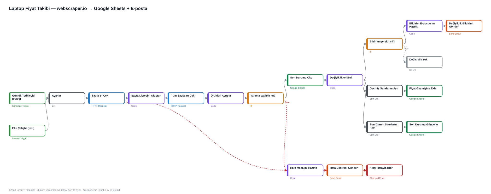

# Uygulama Görevi — AI Otomasyon / Entegrasyon (Nurederm · LabelSkin)

**Doğukan Erdoğan** · 25.09.2026

| | |
|---|---|
| Case e-postası geldi | **11:00** |
| Çalışmaya başladım | **11:06** |
| Son teslim commit'i | **11:50** (teslim sınırı 14:00) |
| Kullandığım yapay zekâ aracı | **Claude Code** (Claude Opus 5.5, masaüstü uygulaması) |

Kodun, testlerin ve dokümantasyonun taslağını Claude Code yazdı. Benim yazdığım promptlar **olduğu gibi ve sırasıyla** [`promptlar/`](promptlar/) klasöründe. Aynı yerde, yapay zekânın yol boyunca karşılaştığı hatalar ve bunları nasıl çözdüğü de var.

---

## Hızlı başlangıç

Gereksinimler: **Python 3.10+** (ek paket yok, sadece standart kütüphane) · B testleri için **Node.js 18+**. API anahtarı, `.env` ya da hesap gerekmiyor.

```bash
# Bölüm A — mesajları işle: talepler.json + ozet.html üretir, terminale özet basar
cd A-mesaj-otomasyonu
python main.py
python -m unittest discover -s tests -v      # 29 test, ağ gerektirmez

# Bölüm B — n8n Code düğümlerinin testleri (ilk test canlı siteye bağlanır)
cd ../B-n8n
node test/kod-testi.mjs                       # 9 test
python araclar/workflow_olustur.py            # workflow.json'u kod/*.js'ten üretir ve doğrular
python araclar/sema_olustur.py                # akis-semasi.svg'yi workflow.json'dan üretir
```

`workflow.json`'u n8n'e aktarmak için: *Workflows → Import from File*. Kurulum adımları [`B-n8n/akis-aciklama.md`](B-n8n/akis-aciklama.md) içinde.

## Klasör yapısı

```
├── A-mesaj-otomasyonu/
│   ├── main.py               giriş noktası (CLI)
│   ├── siniflandirici.py     kural tabanlı konu atama (öncelik sıralı)
│   ├── isleyici.py           iş kuralları: devir, sipariş sahipliği kontrolü, cevap taslakları
│   ├── dummyjson_api.py      API istemcisi (zaman aşımı, yeniden deneme, 404)
│   ├── ozet.py               terminal + HTML özet
│   ├── mesajlar.json         girdi (case'ten)
│   ├── talepler.json         ÇIKTI
│   ├── ozet.html             ÇIKTI: tek sayfalık özet
│   └── tests/                29 birim testi (sahte API ile, ağsız)
├── B-n8n/
│   ├── workflow.json         n8n'e import edilecek akış
│   ├── hata-workflow.json    (ek) Error Trigger → e-posta yedek hata bildirimi
│   ├── akis-aciklama.md      adım adım akış · başlangıç şablonu (ad + link) · neyi değiştirdim
│   ├── akis-semasi.svg       akış şeması (workflow.json'dan üretildi)
│   ├── n8n-calistirma-kaydi.md  gerçek n8n 2.40.7'de CLI ile çalıştırma sonuçları
│   ├── kod/                  Code düğümlerinin JS kaynakları (workflow.json'a gömülür)
│   ├── test/kod-testi.mjs    aynı JS'in Node.js testleri (canlı site dahil)
│   └── araclar/workflow_olustur.py
└── promptlar/
    ├── A-claude-code.md
    └── B-n8n.md
```

---

## Bölüm A — Müşteri mesajı otomasyonu

### Sonuç (15 mesaj)

| # | Mesaj (kısa) | Konu | Devret | Ne oldu |
|---|---|---|:---:|---|
| 1 | "12 numaralı siparişim nerede?" (müşteri 7) | siparis-durumu | **✔** | Sipariş #12'nin sahibi **userId 12**, yazan müşteri 7 → **bilgi verilmedi**, temsilciye devredildi |
| 2 | "5 numaralı siparişimin durumu?" (müşteri 5) | siparis-durumu | – | Sahibi eşleşti → ürünler + toplam tutar (1.467,88 $) |
| 3 | "9999 numaralı siparişim ulaşmadı" | siparis-durumu | **✔** | API "not found" → düzgün uyarı mesajı + temsilci kontrolü |
| 4 | "Serumu kullandım, yüzüm yandı ve kızardı" | istenmeyen-etki | **✔** | Sabit devir metni, **teşhis/öneri yok**, öncelik: yüksek |
| 5 | "Kutu ezik geldi, iade etmek istiyorum" | iade-sikayet | **✔** | Sabit devir metni |
| 6 | "Where is my order #3?" (müşteri 3) | siparis-durumu | – | Eşleşti → **İngilizce** taslak ($1,794.85) |
| 7 | "Takipçi kasmak ister misiniz? bit.ly/…" | diger | – | **Spam**: cevap üretilmedi, linke tıklanmamalı |
| 8 | "Güneş kremi fiyatı? + 4 numaralı siparişim" | siparis-durumu | – | Sipariş bilgisi + fiyat sorusu da yanıtlandı (ikincil konu) |
| 9 | "Retinol serumunuz var mı? Kuru ciltte…" | urun-sorusu | – | Stok + cilt uygunluğu → ürün uzmanına yönlendiren taslak |
| 10 | "Nemlendirici krem ne kadar?" | fiyat | – | **Bonus arama**: katalogdan "Vaseline Men Body and Face Lotion — 9,99 $" |
| 11 | "C vitamini serumu hangi cilt tipine?" | urun-sorusu | – | Ürün uzmanına yönlendiren taslak |
| 12 | "Siparişler hangi kargo firmasıyla?" | diger | – | Genel SSS. `[KARGO FİRMASI]` yer tutucusu (bilgi uydurulmadı) |
| 13 | "Tonik 200 ml mi? Alkol var mı?" | urun-sorusu | – | "200" sipariş no sanılmadı. Hacim + alkol içeriği |
| 14 | "İndirim kodu? Fiyat listesi?" | fiyat | – | **Bonus**: API'den kozmetik fiyat listesi. İndirim kodu uydurulmadı |
| 15 | "Ürünleriniz hayvanlarda test ediliyor mu?" | urun-sorusu | – | Politika sorusu → ürün uzmanına |

**Konu dağılımı:** siparis-durumu 5 · urun-sorusu 4 · fiyat 2 · diger 2 · iade-sikayet 1 · istenmeyen-etki 1 → **4 mesaj insana devredildi** (#1, #3, #4, #5). Detaylar [`talepler.json`](A-mesaj-otomasyonu/talepler.json) ve [`ozet.html`](A-mesaj-otomasyonu/ozet.html) içinde.

### Tasarım kararları

**1. Kural tabanlı sınıflandırma (LLM değil).** Case anahtarsız çalışmayı istiyor. Kurallar deterministik ve test edilebilir. Her kararın gerekçesi (eşleşen ifade) `not` alanına yazılıyor, temsilci neden o konunun seçildiğini görebiliyor. Türkçe karakterler katlanıyor (`şikayet` = `sikayet`), böylece Türkçe karakter kullanmadan yazan müşteri de doğru sınıflanıyor.

**2. Öncelik sırası:** `istenmeyen-etki > iade-sikayet > spam > siparis-durumu > fiyat > urun-sorusu > diger`. Sağlık şikâyeti, aynı mesajda sipariş numarası da geçse hiçbir zaman başka bir konunun altında kaybolmaz (testi var). Kazanmayan konular `ikincil_konular` olarak saklanıyor. Örneğin #8'de hem sipariş hem fiyat yanıtlanıyor.

**3. Sipariş güvenliği (en kritik kısım):**
- `siparis_sorgula()` sipariş **başka müşteriye aitse hiçbir alanını dışarı döndürmüyor**. Ürün, tutar ya da sahip bilgisi programın geri kalanına hiç ulaşmıyor (veri minimizasyonu).
- **Fail-closed:** `userId` ya da `musteri_id` eksik veya sayı değilse eşleşme yok sayılıyor. `musteri_id` yoksa API'ye hiç gidilmiyor.
- **"Bulunamadı" ve "başkasına ait" durumlarında müşteriye aynı metin gidiyor.** Farklı metin gitseydi, biri numara deneyerek hangi sipariş numaralarının var olduğunu öğrenebilirdi. Fark sadece iç notta ve `devret` alanında. Bu yüzden 9999 (bulunamadı) de temsilciye devrediliyor, çünkü temsilci müşterinin gerçek siparişini bulabilir.
- Test: #12'nin ürünleri ("Rolex", "Sportbike") ve tutarı çıktının **hiçbir alanında** geçmiyor. Sahiplik kontrolünü bilerek devre dışı bıraktığımda **5 test kırmızıya döndü**. Yani testler bu açığı gerçekten yakalıyor.

**4. Hassas konular:** `iade-sikayet` ve `istenmeyen-etki` için taslak, **sabit bir devir bildirimi** ("mesajınızı uzman temsilcimize ilettik"). Otomatik ürün önerisi ya da teşhis yok, bu konularda ürün araması da yapılmıyor (testi var). Temsilciye yönelik iç notta istenmeyen etki için *yüksek öncelik* ve kozmetovijilans hatırlatması var: lot no, fotoğraf, gerekirse TİTCK bildirimi.

**5. Bilgi uydurmama.** API'de kargo durumu, ürün içeriği ya da indirim kodu yok. Taslaklar bunları uydurmuyor, ya ilgili uzmana yönlendiriyor ya da `[KARGO FİRMASI]` gibi açık bir yer tutucu bırakıyor. İç not neyin doldurulması gerektiğini söylüyor.

**6. Bonus ürün araması.** DummyJSON genel bir mağaza: `cream` araması **"Ice Cream"** (market ürünü) ve açıklamasında "creamy" geçen **"Red Lipstick"** döndürüyor. Bu yüzden sonuçlar *kozmetik kategorisi (beauty / skin-care / fragrances) + başlıkta terim geçmesi* şartıyla filtreleniyor. Türkçe terimler İngilizce arama terimlerine eşleniyor (nemlendirici → moisturizer, lotion). Kozmetik terimlerinin çoğu (serum, retinol, sunscreen, toner) API'de sonuç vermiyor. Bu durum iç nota yazılıyor, müşteriye "bulunamadı" denmiyor.

**7. Diğer detaylar:** İngilizce mesaja İngilizce taslak. Spam'e cevap yok. `Tonik 200 ml` içindeki 200 sipariş numarası sanılmıyor (sipariş numarası sadece "12 numaralı sipariş", "sipariş no:", "order #3" gibi açık bağlamla alınıyor). API'de zaman aşımı, 5xx hatalarında yeniden deneme var; ağ tamamen çökerse program çökmüyor, mesaj temsilciye devrediliyor (testi var). Windows konsolunda Türkçe karakter bozulmasın diye stdout UTF-8'e alınıyor.

### Tartışmalı sınıflandırmalar (bilinçli seçimler)
- **#8** hem fiyat hem sipariş soruyor. Brief tek konu istediği için **siparis-durumu** seçildi: güvenlik kontrolü gerektiren ve aksiyon alınması gereken niyet bu. Fiyat sorusu da taslakta yanıtlanıyor.
- **#12** "Siparişler hangi kargo firmasıyla…" belirli bir siparişin durumu değil, genel bir SSS sorusu. Bu yüzden **diger**. `siparis-durumu` seçilseydi müşteriye anlamsız şekilde sipariş numarası sorulurdu.
- **#15** hayvan deneyi, ürün politikasıyla ilgili bir soru. Bu yüzden **urun-sorusu**. `diger` de savunulabilirdi.

## Bölüm B — n8n fiyat takibi

Başlangıç şablonu: **[Competitor Price Monitoring with Web Scraping, Google Sheets & Telegram](https://n8n.io/workflows/4640-competitor-price-monitoring-with-web-scrapinggoogle-sheets-and-telegram/)** (#4640). Seçim tablosu ve bildirim kanalı: **Google Sheets + e-posta**.

Akış: günlük 09:00 tetikleyici → 1. sayfadan son sayfa numarasını bul (bugün 20) → tüm sayfaları gez → ad / **sayısal fiyat** / yorum / link → sağlık kontrolü → Google Sheets'teki `son_durum` ile karşılaştır → yeni / fiyatı değişen / kalkan ürünleri e-postayla bildir → `fiyat_gecmisi`ne tarih damgasıyla ekle. **Hata dalı:** site açılmazsa, sayfa eksik kalırsa ya da hiç ürün gelmezse hata e-postası gider ve akış **Stop and Error** ile başarısız biter.

**Gerçek n8n'de denendi:** Akış yerel bir n8n 2.40.7'ye CLI ile içe aktarılıp çalıştırıldı. 20 sayfa gezildi ve 117 ürün sayısal fiyatla ayrıştırıldı; akış credential bağlanmamış Google Sheets adımına kadar hatasız geldi. İki hata senaryosunda (site kapalı / hiç ürün yok) hata dalı çalıştı ve yürütme `error` durumunda bitti ([çalıştırma kaydı](B-n8n/n8n-calistirma-kaydi.md)). Bu test JSON'daki iki eksiği ortaya çıkardı (CLI için workflow `id`, CLI ile çalıştırma için Manual Trigger) ve ikisi de düzeltildi.

Adım adım açıklama, şablondan yapılan değişiklikler (şablondaki `NaN` yanlış-alarm hatası dahil) ve test sonuçları: **[`B-n8n/akis-aciklama.md`](B-n8n/akis-aciklama.md)**.



---

## Yapay zekâ aracını nasıl kullandım

Claude Code'a tek bir başlangıç promptu verdim ("mailimdeki case'i beraber eksiksiz yapalım"). Case e-postasını ve eklerini Gmail bağlantısı üzerinden kendisi okudu. Karar gerektiren iki noktada bana sordu, ben seçtim: teslim için GitHub reposunu benim açmam ve B'de **Google Sheets + e-posta** kullanılması. Sonra repoyu açıp linkini verdim.

Çalışma sırasında izlenen yöntem:
1. **Önce veriyi doğrulama:** Kod yazılmadan önce DummyJSON'daki ilgili siparişler (#12'nin başka müşteriye ait olduğu, 9999'un 404 döndüğü), ürün araması sonuçları ve test sitesinin HTML'i / sayfalaması elle kontrol edildi.
2. **Parçalama:** A'da sınıflandırıcı → API istemcisi → iş kuralları → özet → testler. B'de şablonu indirip inceleme → eksiklerini listeleme → Code düğümlerini ayrı dosyada yazma → Node.js'te test → `workflow.json` üretimi ve doğrulama.
3. **Çıktıyı sorgulama:** İlk çalıştırmadaki 15 taslak tek tek okundu ve bulunan kusurlar düzeltildi: "alkol var mı" stok sorusu sanılıyordu, kargo SSS taslağında uydurma bir süreç cümlesi vardı, notlarda noktalama eksikti.
4. **Testin kendisini test etme:** Tüm testler ilk seferde geçince, sahiplik kontrolü bilerek bozuldu ve testlerin bunu yakaladığı doğrulandı (5 test kırmızı).
5. **Varsayımları kaynağından doğrulama:** n8n düğüm sürümleri ve parametre adları, n8n-nodes-base 2.15.1 paketinin kendisinden kontrol edildi.

## Nerede takıldım

Hepsi Windows ortamından kaynaklandı. Ayrıntılar ve çözümleri [`promptlar/`](promptlar/) dosyalarındaki süreç günlüğünde.

- E-posta eklerini diske yazarken ve git'te **Windows 260 karakter yol sınırı** hataları çıktı. Masaüstü uygulamasının çalışma klasörü, arka planda çok uzun bir sanal yola yönlendiriliyordu. Python testleri "dosya bulunamadı" verdi. Proje kısa bir yola taşındı, git'te `core.longpaths` açıldı.
- `npm install n8n` ilk denemede bash ortamında `cmd.exe` başlatılamadığı için başarısız oldu. Önce düğüm tanımları n8n-nodes-base paketinden okundu, sonra n8n PowerShell ile kuruldu.
- Gerçek n8n testinde `workflow.json` iki yerde takıldı: CLI içe aktarımı workflow `id` istedi, CLI ile çalıştırma da Manual Trigger istedi. İkisi de düzeltildi.

## Neyi bitiremedim / sınırlar

- **n8n'de Google Sheets ve e-posta adımlarını canlı çalıştıramadım.** Credential gerekiyor ve bende firmanın Sheet'i ya da SMTP bilgisi yok. Bu adımların girdisi olan değişiklik tespiti mantığı Node testleriyle doğrulandı; akışın geri kalanı gerçek n8n'de çalıştırıldı. İçe aktarımdan sonra Sheets sütun eşlemesinin bir kez kontrol edilmesi gerekiyor.
- n8n arayüz ekran görüntüsü eklemedim. Yerel n8n arayüzü sahip hesabı kurulumu istiyor; onun yerine CLI çalıştırma kaydı ve `workflow.json`'dan üretilmiş akış şeması var.
- Sınıflandırıcı kural tabanlı. Bu 15 mesajı ve testlerdeki varyasyonları doğru sınıflıyor, ama kalıplara uymayan yeni bir ifade `diger` + devret'e düşer (güvenli taraf). Üretimde bir sonraki adım: kuralların emin olamadığı mesajlar için bir LLM sınıflandırıcıyı yedek olarak kullanmak ve etiketli mesajlarla doğruluğunu ölçmek.
- DummyJSON'da kargo/teslimat durumu yok. Bu yüzden sipariş taslakları ürünleri ve tutarı veriyor, kargo durumunu temsilciye bırakıyor.
